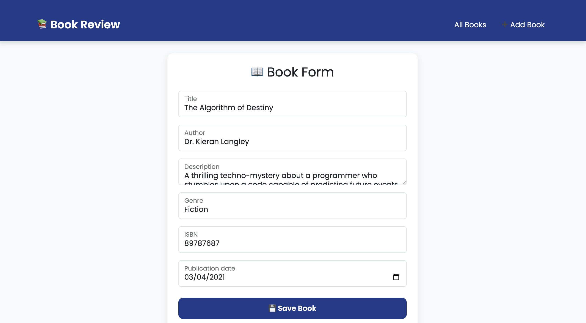
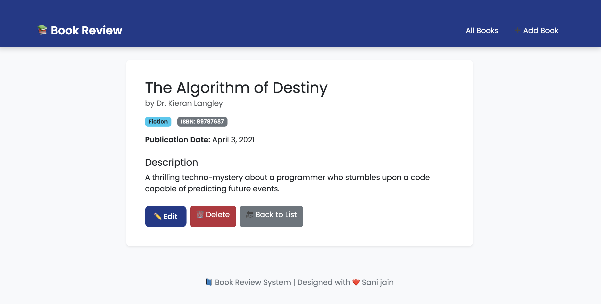

# 📚 Book Review System

**Book Review System** is a **Django-based web application** that allows users to **add, view, edit, and delete books**, while providing a clean, modern interface for managing book details and reviews. Built with **Bootstrap 5** for a responsive, modern design, this system is perfect for learning full-stack Django development.

---

## 🎯 Project Purpose

This project is designed to manage a collection of books in an **organized and interactive way**.  
Users can easily:
- Add new books with title, author, genre, ISBN, publication date, description, and optional cover image.  
- View a list of all books, filtered by genre.  
- Access detailed information about each book.  
- Edit or delete book entries.  

It’s ideal for **students, small libraries, or personal book collections**.

---

## 🚀 Features

1. **User-Friendly Interface** – Modern, responsive UI using **Bootstrap 5**.  
2. **Book Management** – Add, update, delete, and view book details.  
3. **Genre Filtering** – Filter book list by genre.  
4. **Responsive Layout** – Works on desktops, tablets, and mobile devices.  
5. **Optional Cover Images** – Upload images for each book.  
6. **Clean Navigation** – Easy access to book list, add book form, and book details.  
7. **Flash Messages** – Inform users of successful or failed actions.

---

## 🛠️ Tech Stack

- **Backend:** Django 5+ (Python 3.12+)  
- **Frontend:** HTML, CSS, Bootstrap 5  
- **Database:** SQLite (default)  
- **Other:** Django templating engine, CSRF protection, Django messages framework  

---

## 📦 Installation & Setup

Follow these steps to run the project locally:

1. **Clone the repository**

git clone https://github.com/sanij0579/BookReviewSystem.git
cd BookReviewSystem

2.	Create a virtual environment
	python3 -m venv venv
source venv/bin/activate   # Linux/Mac
# venv\Scripts\activate    # Windows
3.	Install dependencies
   pip install -r requirements.txt
🧑‍💻 Usage

Adding a Book
	1.	Navigate to Add Book in the navbar.
	2.	Fill in the book details and optional cover image.
	3.	Submit to add the book to the collection.

Viewing Books
	1.	Go to Books in the navbar.
	2.	Filter by genre or view all books.
	3.	Click View Details for more information.

Editing / Deleting
	1.	In the book detail page, click Edit to modify details.
	2.	Click Delete to remove the book.

⸻

🎨 UI / UX Features
	•	Modern card-based layout for book listings.
	•	Hover effects for interactive feel.
	•	Responsive design for mobile and desktop.
	•	Genre badges for quick identification.
	•	Flash messages for user feedback.
 ## 📸 Screenshots

### Book List Page

### Add / Edit Book Page

### Book Detail Page

 
